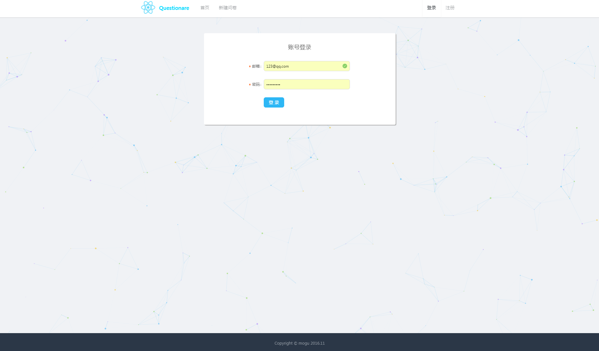
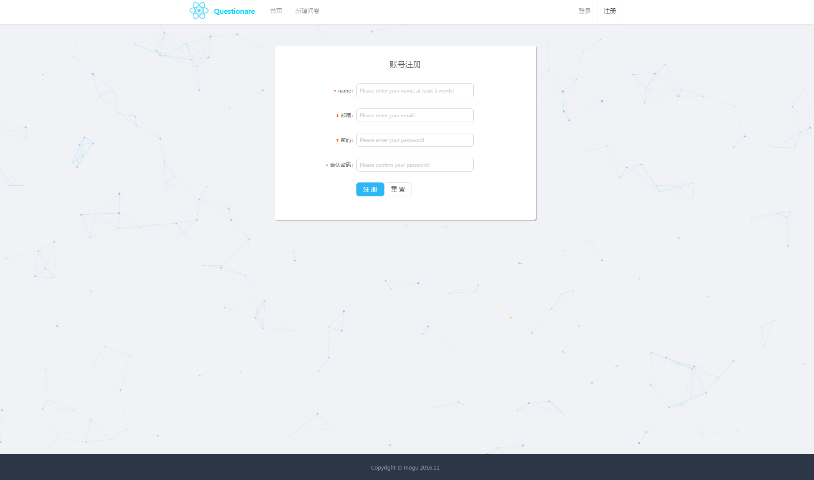
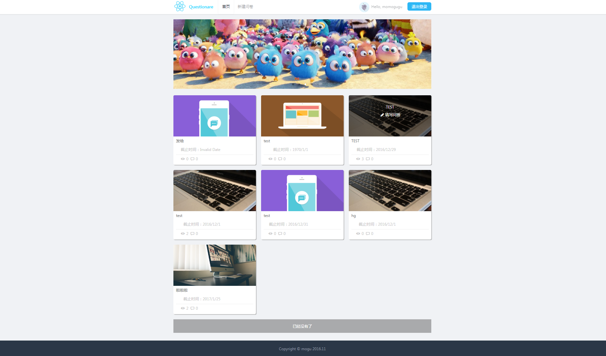
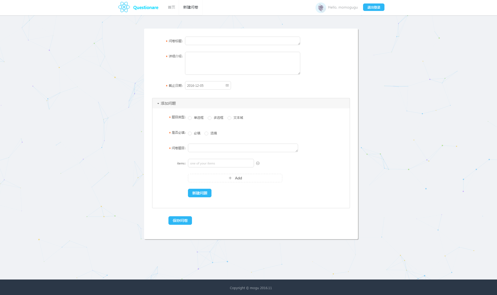
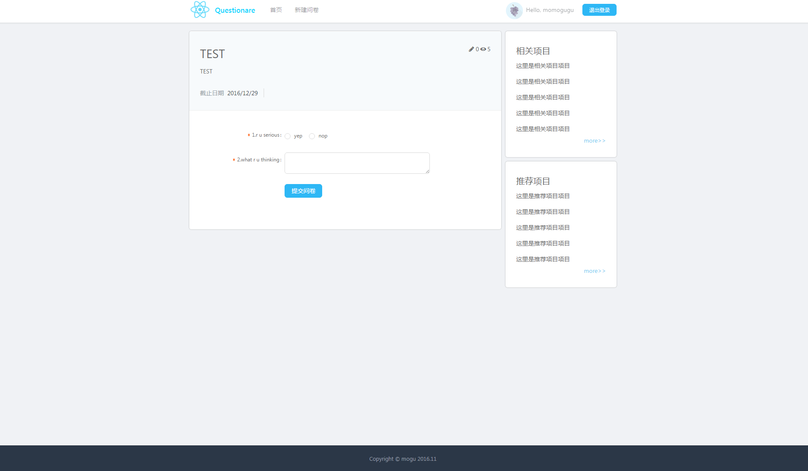
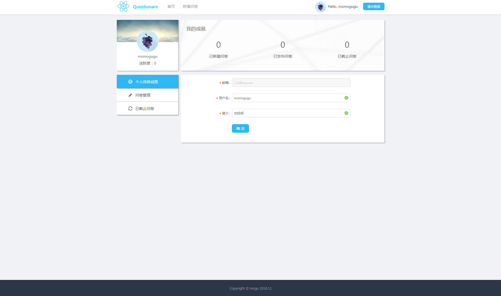

###问卷系统

+ React
+ Redux
+ Ant Desgin
+ Koa
+ Mongodb

***

运行：

1. 安装并运行mongodb
2. npm i, 安装依赖
3. npm run server, 运行服务端
4. npm run dev, 运行客户端
5. 访问 http://127.0.0.1:8080/

***

风格参考：
https://github.com/husterxsp

***

项目运行截图：

/auth/login

/auth/register

/

/publish

/project/_id

/user/setting

/user/project

